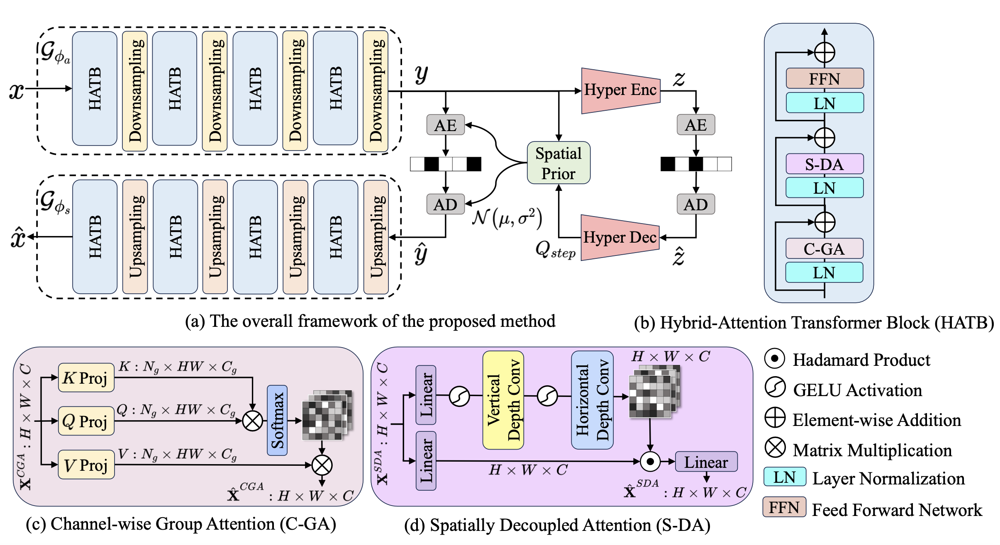
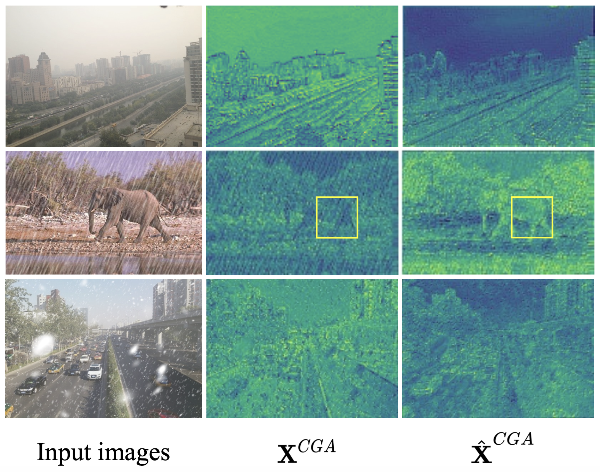
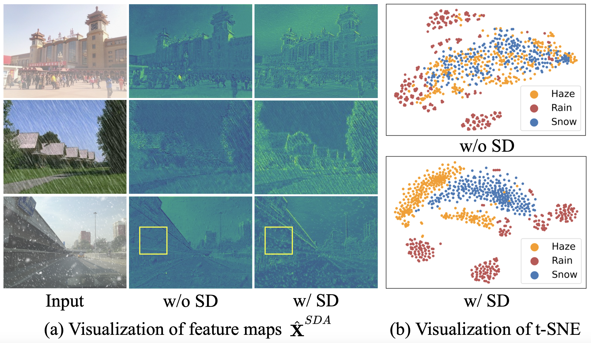

# All-in-One Image Compression and Restoration  
<a href="https://openaccess.thecvf.com/content/WACV2025/papers/Zeng_All-in-One_Image_Compression_and_Restoration_WACV_2025_paper.pdf"></a> 
<a href="https://openaccess.thecvf.com/content/WACV2025/supplemental/Zeng_All-in-One_Image_Compression_WACV_2025_supplemental.pdf"></a> <a href="https://arxiv.org/pdf/2502.03649"></a>  <a href="https://video.computer.org/WACV-Posters25/5AaMB5jWKpzI96r1JNNwsl-wacv25-425.mp4"></a>


[Huimin Zeng](https://zeldam1.github.io/), [Jiacheng Li](http://home.ustc.edu.cn/~jclee/),
[Ziqiang Zheng](https://zhengziqiang.github.io/), [Zhiwei Xiong](http://staff.ustc.edu.cn/~zwxiong/)


## 🔥 Update
🔥 2025/3/9: We provide [benchmark](benchmark/README.md) for all-in-one image restoration.

2025/3/8: We release code and [checkpoint](https://drive.google.com/drive/folders/1uQNUGUWtibMX1EB9Y33Zh-Ss6fK7tC9C?usp=sharing) for this project.

2025/1/20: Our All-in-One was selected as **Oral** presentation.

2024/10/28: All-in-One was accepted to WACV 2025


## Introduction
Visual images corrupted by various types and levels of degradations are commonly encountered in practical image compression. However, **most existing image compression methods are tailored for clean images**, therefore struggling to achieve satisfying results on these images. **Joint compression and restoration methods typically focus on a single type of degradation** and fail to address a variety of degradations in practice. To this end, we propose a unified framework for all-in-one image compression and restoration, which incorporates the image restoration capability against various degradations into the process of image compression. Extensive experiments demonstrate the following merits of our model: 1) superior rate-distortion (RD) performance on various degraded inputs while preserving the performance on clean data; 2) strong generalization ability to real-world and unseen scenarios; 3) higher computing efficiency over compared methods.  

  
## Overview
 The key challenges involve distinguishing authentic image content from degradations, and flexibly eliminating various degradations without prior knowledge. Specifically, the proposed framework approaches these challenges from two perspectives: *i.e.*, content information aggregation, and degradation representation aggregation. 

 

## Dataset
| Setting        | Degradation   | Train           | Test            |
|----------------|---------------|-----------------|-----------------|
| Weather        | Haze-Snow-Rain         | [RESIDE](https://sites.google.com/site/boyilics/website-builder/reside)-[CSD](https://github.com/weitingchen83/ICCV2021-Single-Image-Desnowing-HDCWNet?tab=readme-ov-file)-[Rain1400](https://xueyangfu.github.io/projects/cvpr2017.html)      | [RESIDE](https://sites.google.com/site/boyilics/website-builder/reside)-[CSD](https://github.com/weitingchen83/ICCV2021-Single-Image-Desnowing-HDCWNet?tab=readme-ov-file)-[Rain1400](https://xueyangfu.github.io/projects/cvpr2017.html)       |
| Gaussian Noise | σ = 15-25-50        | [Open Images](https://storage.googleapis.com/openimages/web/index.html)| [Kodak](https://r0k.us/graphics/kodak/)     |
* The adopted datasets can be found above.
* Download all the datasets and structure the data as follows:
```
data
|-- all-in-one-test
|   |-- CSD_test
|   |-- SOTS_outdoor
|   |-- rain1400_test
|   |-- Kodak_24
|   `-- all_in_one.json
`-- all-in-one-train
    |-- CSD_train
    |-- OTS_outdoor
    |-- rain1400_train
    |-- open_images
    |-- all_in_one.json
    `--  description_v2.json
```


## Environment 
We provide  docker image to prepare the running enviroment. The docker image can be obtained using the following command: 
```
docker pull registry.cn-hangzhou.aliyuncs.com/zenghuimin/zhm_docker:py37-torch18
pip install pytorch_msssim scipy mmengine timm==0.6.7
```

## Test
* Clean images
```
bash scripts/test_script_clean.sh 
```
* The Weather Setting
```
bash scripts/test_script_weather.sh 
```
* The Gaussian Noise Setting
```
bash scripts/test_script_noise.sh 
```
We provide pre-trained checkpoint on [GoogleDrive](https://drive.google.com/drive/folders/1uQNUGUWtibMX1EB9Y33Zh-Ss6fK7tC9C?usp=sharing). Please download and put it at `./ckpt`.

## Acknowledgement
This repository is partly built on [DCVC-FM](https://github.com/microsoft/DCVC/tree/main/DCVC-FM) and [MMagic](https://github.com/open-mmlab/mmagic). We appreciate their authors for creating these brilliant works and sharing codes with the community. We also thank **[Ziyu Zhao](https://ziyuz-vision.github.io/)** for his support of this project and valuable contributions to this repository.


## Citation
If you find our All-in-One useful, please star ⭐ this repository and consider citing:
```bibtex
@inproceedings{zeng2025all,
  title={All-in-One Image Compression and Restoration},
  author={Zeng, Huimin and Li, Jiacheng and Zheng, Ziqiang and Xiong, Zhiwei},
  booktitle={2025 IEEE/CVF Winter Conference on Applications of Computer Vision (WACV)},
  pages={609--619},
  year={2025},
  organization={IEEE}
}
```
